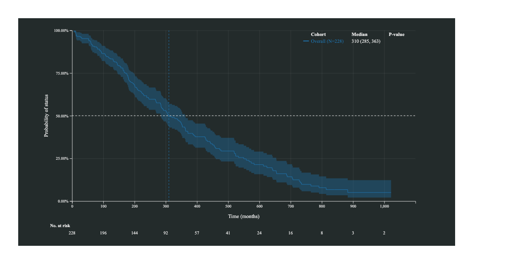
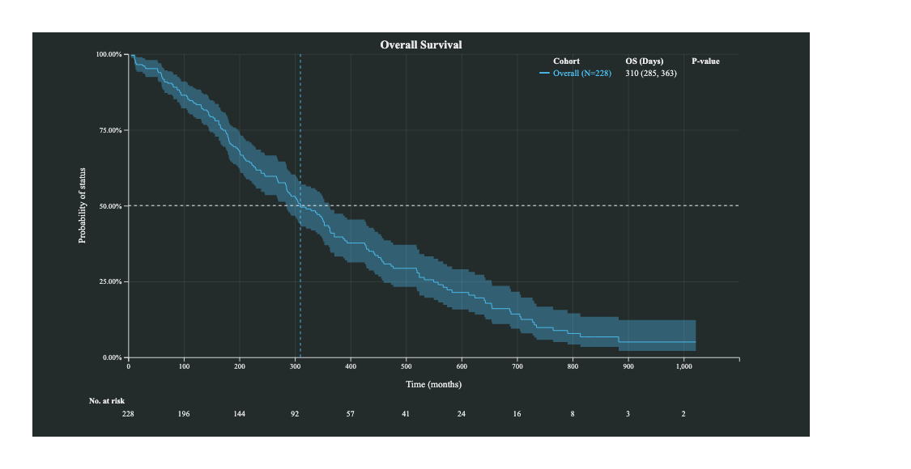
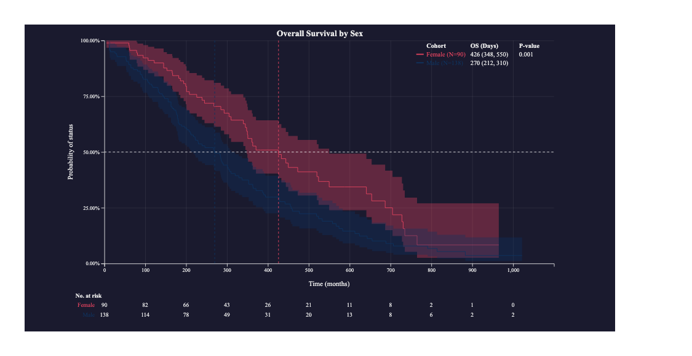
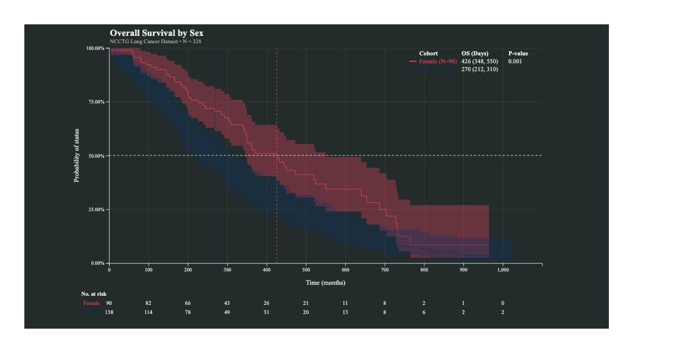
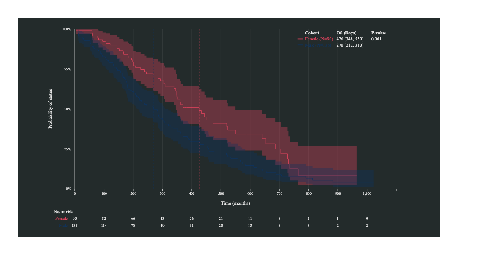
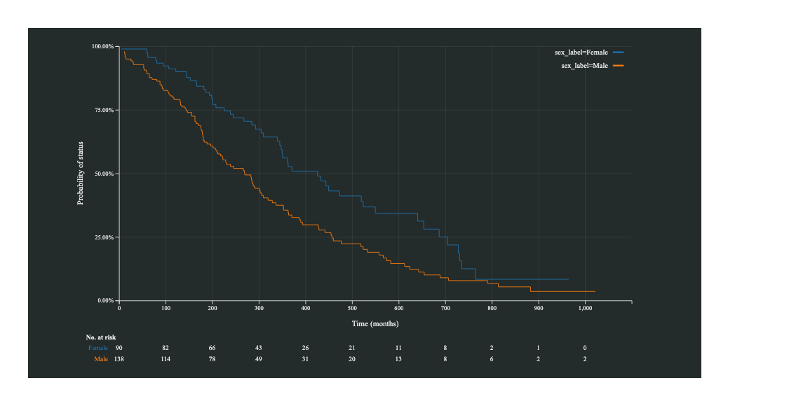
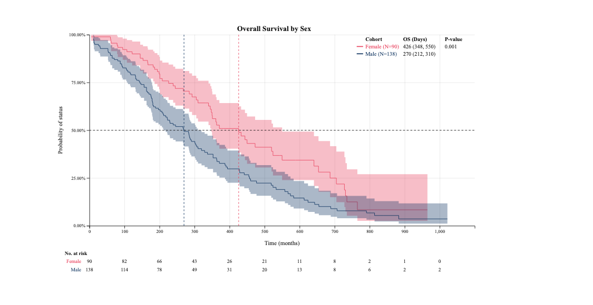
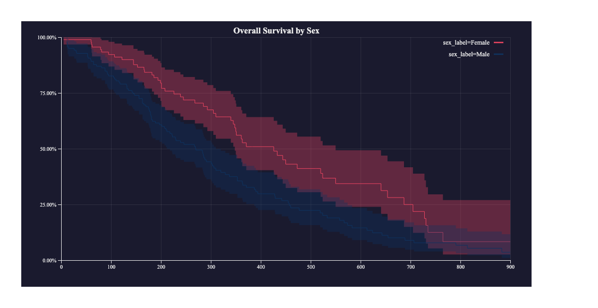

```{r setup, include=FALSE}
knitr::opts_chunk$set(
  collapse = TRUE,
  comment  = "#>",
  eval     = FALSE
)
```

`rd3survival` renders interactive Kaplan-Meier survival curves as self-contained SVGs using D3.js v5.  Curves update live on hover and support brush-to-zoom.  The package provides two entry points:

- **`rd3survival_km()`** — high-level wrapper: accepts a raw data frame, fits the model, and enriches the chart with medians, p-values, and a number-at-risk table.
- **`rd3survival()`** — low-level widget: accepts a `survfit` object directly for cases where the model is already fitted.

## Installation

```{r install}
remotes::install_github("gh-dhintz/rd3survival")
```

## Data preparation

All examples use the `lung` dataset from the `survival` package, which ships with R.

```{r data}
library(survival)
library(rd3survival)

lung2 <- lung
lung2$status    <- lung2$status - 1   # survival::lung uses 1/2; recode to 0/1
lung2$sex_label <- ifelse(lung2$sex == 1, "Male", "Female")
```

---

## 1. Single-arm plot

The minimal call needs only a data frame, the time column, and the event column.

```{r single}
rd3survival_km(
  df            = lung2,
  time_var      = "time",
  event_var     = "status",
  x_break_every = 100
)
```



Add a title, endpoint label, and time unit to populate the annotation table:

```{r single-annotated}
rd3survival_km(
  df            = lung2,
  time_var      = "time",
  event_var     = "status",
  title         = "Overall Survival",
  endpoint      = "OS",
  time_unit     = "Days",
  x_break_every = 100,
  color         = "#4fc3f7"
)
```



---

## 2. Stratified plot

Supply `strat_var` to draw one curve per group.  A log-rank p-value and per-strata medians are computed automatically.

```{r stratified}
rd3survival_km(
  df            = lung2,
  time_var      = "time",
  event_var     = "status",
  strat_var     = "sex_label",
  color         = c("#e94560", "#0f3460"),
  title         = "Overall Survival by Sex",
  endpoint      = "OS",
  time_unit     = "Days",
  x_break_every = 100,
  bg_color      = "#1a1a2e"
)
```



The annotation table in the top-right corner shows:

| Cohort | OS (Days) | P-value |
|---|---|---|
| Female | median (LCL, UCL) | log-rank p |
| Male | median (LCL, UCL) | |

---

## 3. Title and subtitle

Both title and subtitle support independent font size and horizontal position.  Positions are expressed as a proportion of the total SVG width (0 = far left, 1 = far right); omit to centre.

```{r titles}
rd3survival_km(
  df                 = lung2,
  time_var           = "time",
  event_var          = "status",
  strat_var          = "sex_label",
  color              = c("#e94560", "#0f3460"),
  title              = "Overall Survival by Sex",
  title_x            = 0.08,
  title_font_size    = 18,
  subtitle           = "NCCTG Lung Cancer Dataset  •  N = 228",
  subtitle_x         = 0.08,
  subtitle_font_size = 11,
  endpoint           = "OS",
  time_unit          = "Days",
  x_break_every      = 100
)
```



---

## 4. Y-axis format

Control how survival probability is displayed on the y-axis with a D3 format string:

```{r yformat}
# Default: "100.00%"
rd3survival_km(lung2, "time", "status", y_format = ".2%")

# Compact: "100%"
rd3survival_km(lung2, "time", "status", y_format = ".0%")

# Proportion: "1.00"
rd3survival_km(lung2, "time", "status", y_format = ".2f")

# Integer proportion: "1"
rd3survival_km(lung2, "time", "status", y_format = ".0f")
```



---

## 5. Hiding optional elements

```{r hide}
rd3survival_km(
  df            = lung2,
  time_var      = "time",
  event_var     = "status",
  strat_var     = "sex_label",
  x_break_every = 100,
  show_median   = FALSE,   # hide crosshairs and annotation table
  conf_int      = FALSE    # hide confidence-interval bands
)
```



---

## 6. Color contrast

`color_contrast` switches between a dark and light theme.  `"WoB"` (white on black) is the default; `"BoW"` (black on white) flips the background to white and all non-strata text, axis lines, tick marks, grid lines, risk table numbers, and the median crosshair to near-black.  Per-strata curve colours are preserved in both modes.

```{r color-contrast}
# Black on white
rd3survival_km(
  df             = lung2,
  time_var       = "time",
  event_var      = "status",
  strat_var      = "sex_label",
  color          = c("#e94560", "#0f3460"),
  title          = "Overall Survival by Sex",
  endpoint       = "OS",
  time_unit      = "Days",
  x_break_every  = 100,
  color_contrast = "BoW"
)
```



---

## 7. Low-level widget — `rd3survival()`

Use `rd3survival()` when you have a pre-fitted model or need `xlim`/`ylim` control.

```{r lowlevel}
sf <- survfit(Surv(time, status) ~ sex_label, data = lung2)

rd3survival(
  sf,
  title    = "Overall Survival by Sex",
  bg_color = "#1a1a2e",
  colors   = c("#e94560", "#0f3460"),
  xlim     = c(0, 900),
  ylim     = c(0, 1)
)
```



Any option accepted by `rd3survival_km()` can be passed via the `opts` list:

```{r lowlevel-opts}
rd3survival(
  sf,
  colors = c("#e94560", "#0f3460"),
  opts = list(
    x_label    = "Time (days)",
    y_label    = "Survival probability",
    y_format   = ".0%",
    x_breaks   = seq(0, 1000, by = 100),
    conf_int   = FALSE
  )
)
```

---

## 8. Saving to HTML

```{r save}
p <- rd3survival_km(
  lung2, "time", "status",
  strat_var = "sex_label",
  title     = "Overall Survival by Sex"
)

htmlwidgets::saveWidget(p, "km_stratified.html", selfcontained = TRUE)
```

The resulting file is fully self-contained — no external dependencies required to open it.

---

## 9. Shiny integration

```{r shiny}
library(shiny)

ui <- fluidPage(
  titlePanel("Survival Explorer"),
  sidebarLayout(
    sidebarPanel(
      selectInput("strat", "Stratify by",
                  choices = c("None" = "", "Sex" = "sex_label"))
    ),
    mainPanel(
      rd3survivalOutput("km_plot", height = "500px")
    )
  )
)

server <- function(input, output) {
  output$km_plot <- renderRd3survival({
    sv <- if (nchar(input$strat) == 0) NULL else input$strat
    rd3survival_km(
      df            = lung2,
      time_var      = "time",
      event_var     = "status",
      strat_var     = sv,
      title         = "Overall Survival",
      endpoint      = "OS",
      time_unit     = "Days",
      x_break_every = 100
    )
  })
}

shinyApp(ui, server)
```

---

## Interactivity reference

| Interaction | Behaviour |
|---|---|
| Hover | Tooltip: time, survival %, 95% CI, at-risk count per strata |
| Click and drag | Brush-zoom into selected region |
| Click without drag | Reset to full extent |

---

## Parameter quick reference

### `rd3survival_km()`

| Argument | Default | Description |
|---|---|---|
| `df` | — | Input data frame |
| `time_var` | — | Follow-up time column name |
| `event_var` | — | Event indicator column name (0/1) |
| `strat_var` | `NULL` | Stratification column; `NULL` = single-arm |
| `color` | `NULL` | CSS colour(s); `NULL` = D3 category-10 |
| `title` | `NULL` | Chart title |
| `subtitle` | `NULL` | Subtitle below title |
| `title_x` | `NULL` | Title x start (0–1 proportion); `NULL` = centred |
| `subtitle_x` | `NULL` | Subtitle x start; `NULL` = centred |
| `title_font_size` | `NULL` | Title font size (px); default 16 |
| `subtitle_font_size` | `NULL` | Subtitle font size (px); default 12 |
| `endpoint` | `NULL` | Annotation table endpoint label |
| `time_unit` | `NULL` | Annotation table time unit |
| `x_label` | `"Time (months)"` | X-axis label |
| `y_label` | auto | Y-axis label |
| `x_break_every` | `4` | X-axis tick interval |
| `show_median` | `TRUE` | Show median crosshairs and table |
| `conf_int` | `TRUE` | Show 95% CI bands |
| `y_format` | `".2%"` | D3 y-axis format string |
| `bg_color` | `"#232b2b"` | SVG background colour |
| `width`, `height` | `NULL` | Widget dimensions |
| `elementId` | `NULL` | Fixed HTML element ID |
